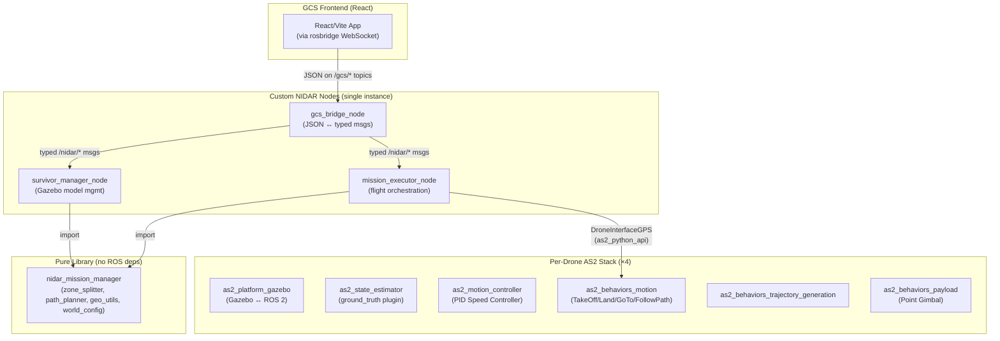
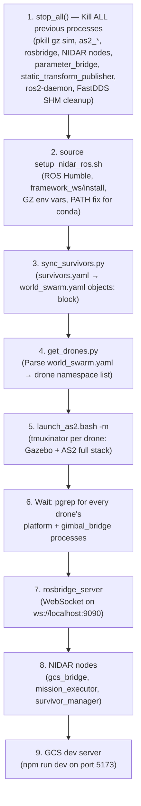
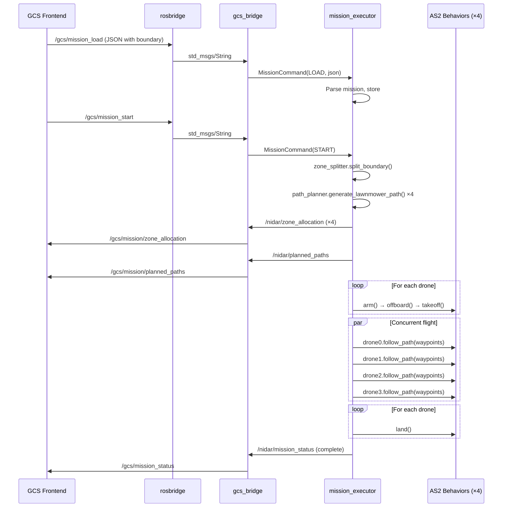
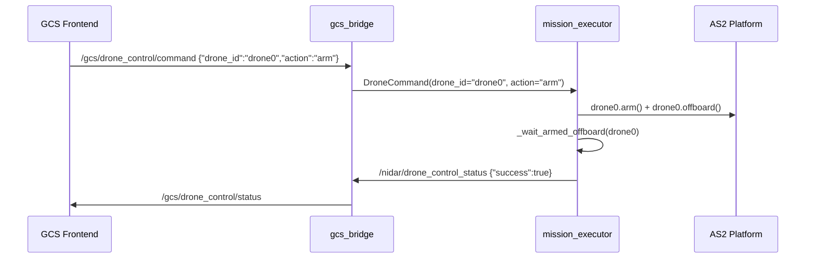

# NIDAR RescueSwarm — Complete System Architecture Reference

**Stack:** ROS 2 Humble · AeroStack2 (AS2) · Gazebo Harmonic · React/Vite GCS  
**Current State:** Phase 0–1 complete (4-drone SITL, coverage path planning, interactive GCS)  
**Target:** Autonomous multi-drone SAR system for competition (detection, geotagging, delivery)

---

## 1. Project Directory Structure

```
NIDAR/
├── framework_ws/                   # Colcon ROS 2 workspace
│   ├── src/
│   │   ├── aerostack2/             # Vendored AS2 framework (full clone)
│   │   ├── nidar_msgs/             # Custom message & action definitions
│   │   ├── nidar_gcs_bridge/       # GCS ↔ typed ROS 2 topic translator
│   │   ├── nidar_mission_executor/ # Multi-drone flight orchestration
│   │   ├── nidar_mission_manager/  # Pure-logic library (zone split, path plan, geo utils)
│   │   └── nidar_survivor_manager/ # Runtime Gazebo survivor spawn/remove
│   ├── build/                      # Colcon build output
│   ├── install/                    # Colcon install overlay
│   └── log/                        # Build logs
├── project_gazebo/                 # Simulation application layer
│   ├── config/                     # World, drone, controller, survivor configs
│   ├── tmuxinator/                 # Per-drone AS2 node launch templates
│   ├── missions/                   # Mission files (JSON, KML)
│   ├── models/                     # Custom Gazebo models (survivor, survivor_actor)
│   ├── trees/                      # AS2 behavior tree XMLs
│   ├── utils/                      # Helper scripts (get_drones, sync_survivors, etc.)
│   ├── launch_as2.bash             # Per-drone tmuxinator launcher
│   └── stop.bash                   # Process cleanup
├── gcs/                            # Ground Control Station (React/Vite/TypeScript)
│   └── src/
│       ├── App.tsx                 # Main layout, state wiring
│       ├── components/             # MapView, MissionLoader, DroneControlPanel, etc.
│       ├── ros/                    # rosbridge hooks (telemetry, mission, zones, survivors)
│       ├── mission/                # KML/JSON parsing, launch site management
│       └── types/                  # TypeScript interfaces
├── scripts/
│   ├── run_simulation.sh           # Single-command full sim launcher
│   └── setup_nidar_ros.sh          # Environment setup (ROS, Gazebo, PATH fixes)
├── DOCUMENTS/                      # Architecture docs, implementation plan, test reports
└── ckpt_*.pth                      # Pre-trained YOLO model checkpoints
```

---

## 2. How AeroStack2 Is Used

### 2.1 Integration Model

AeroStack2 is **vendored** as a full Git clone inside [framework_ws/src/aerostack2/](file:///home/ayush/NIDAR/framework_ws/src/aerostack2). It's built alongside the custom NIDAR packages via `colcon build`. No modifications were made to AS2 itself (except one confirmed bug fix in `gimbal_bridge.cpp` for a startup race condition).

### 2.2 AS2 Packages Used (Per Drone)

Each drone in simulation runs a full AS2 node set, launched via [tmuxinator/aerostack2.yaml](file:///home/ayush/NIDAR/project_gazebo/tmuxinator/aerostack2.yaml):

| AS2 Package | Role | Launch Command |
|---|---|---|
| `as2_gazebo_assets` | Spawns Gazebo world + drone models | `ros2 launch as2_gazebo_assets launch_simulation.py` (first drone only) |
| `as2_platform_gazebo` | Bridges Gazebo ↔ ROS 2 topics for one drone | `ros2 launch as2_platform_gazebo platform_gazebo_launch.py` |
| `as2_state_estimator` | Publishes `self_localization/{odom,pose,twist}` from sensor fusion | `ros2 launch as2_state_estimator state_estimator_launch.py` |
| `as2_motion_controller` | Converts motion references → actuator commands using PID Speed Controller | `ros2 launch as2_motion_controller controller_launch.py` |
| `as2_behaviors_motion` | TakeOff, Land, GoTo, FollowPath action servers | `ros2 launch as2_behaviors_motion motion_behaviors_launch.py` |
| `as2_behaviors_trajectory_generation` | Polynomial trajectory generator for smooth paths | `ros2 launch ... generate_polynomial_trajectory_behavior_launch.py` |
| `as2_behaviors_payload` | Gimbal pointing behavior | `ros2 launch as2_behaviors_payload point_gimbal_behavior.launch.py` |
| `as2_behavior_tree` | XML behavior tree executor (optional, for pre-defined trees) | `ros2 launch as2_behavior_tree behavior_trees.launch.py` |
| `as2_alphanumeric_viewer` | Terminal-based drone status viewer | `ros2 run as2_alphanumeric_viewer as2_alphanumeric_viewer_node` |
| `as2_python_api` | Python API wrapping behavior action clients + telemetry | Imported by `nidar_mission_executor` |

### 2.3 AS2 Configuration

All AS2 nodes for a given drone share a single config file: [config/config.yaml](file:///home/ayush/NIDAR/project_gazebo/config/config.yaml)

Key configuration choices:
- **State Estimator Plugin:** `ground_truth` (sim) — must switch to `raw_odometry` for hardware
- **GPS:** Enabled with `set_origin_on_start: true`
- **Takeoff Plugin:** `takeoff_plugin_position`
- **GoTo Plugin:** `go_to_plugin_position`
- **FollowPath Plugin:** `follow_path_plugin_position`
- **Land Plugin:** `land_plugin_speed`
- **Controller:** PID Speed Controller ([pid_speed_controller.yaml](file:///home/ayush/NIDAR/project_gazebo/config/pid_speed_controller.yaml))
- **Sim time:** `use_sim_time: true` globally

### 2.4 How Custom Packages Interact With AS2



---

## 3. Custom ROS 2 Packages — Detailed Reference

### 3.1 `nidar_msgs` — Message & Action Definitions

**Package type:** `ament_cmake`  
**Location:** [framework_ws/src/nidar_msgs/](file:///home/ayush/NIDAR/framework_ws/src/nidar_msgs)

#### Messages (10 total)

| Message | Fields | Purpose |
|---|---|---|
| `DetectionResult.msg` | `header`, `detection_id` (uint32), `confidence` (float32), `bbox_x/y/w/h` (float32), `drone_id` (string) | YOLO detection output per frame |
| `SurvivorTag.msg` | `header`, `survivor_id` (uint32), `latitude/longitude/altitude` (float64), `confidence` (float32), `detecting_drone_id`, `delivery_assigned/complete` (bool) | Geotagged survivor position |
| `PayloadStatus.msg` | `header`, `drone_id`, `kits_remaining/kits_total` (uint8) | Per-drone payload inventory |
| `MissionBoundary.msg` | `header`, `boundary_vertices` (GeoPoint[]) | Search area polygon |
| `ZoneAllocation.msg` | `header`, `drone_id`, `zone_vertices` (GeoPoint[]) | Per-drone assigned sub-zone |
| `MissionStatus.msg` | `header`, `total_survivors_detected/deliveries_complete` (uint8), `elapsed_time_sec` (float32), `active_drones` (uint8), `phase` (uint8: SETUP/SCANNING/DELIVERING/RTL/COMPLETE) | Overall mission progress |
| `DeliveryStatus.msg` | `header`, `survivor_id` (uint32), `assigned_drone_id`, `status` (uint8: PENDING/EN_ROUTE/DROPPED/CONFIRMED), `drop_distance_m` (float32) | Per-survivor delivery tracking |
| `MissionCommand.msg` | `action` (uint8: LOAD/START), `mission_json` (string) | GCS → executor command |
| `DroneCommand.msg` | `drone_id`, `action` (string: "arm"/"disarm"/"takeoff"), `altitude_m` (float32) | Manual drone control |
| `SurvivorCommand.msg` | `action` (string: "add"/"remove"/"clear"), `survivor_id`, `latitude/longitude` (float64) | Runtime survivor management |

#### Actions (1)

| Action | Goal | Result | Feedback | Purpose |
|---|---|---|---|---|
| `PayloadRelease.action` | `target_latitude/longitude` (float64), `survivor_id` (uint32) | `success` (bool), `drop_distance_m` (float32) | `approach_progress_pct` (float32) | Servo-actuated kit release |

---

### 3.2 `nidar_gcs_bridge` — GCS Protocol Translator

**Package type:** `ament_python`  
**Location:** [framework_ws/src/nidar_gcs_bridge/](file:///home/ayush/NIDAR/framework_ws/src/nidar_gcs_bridge)  
**Node name:** `gcs_bridge`  
**Entry point:** `ros2 run nidar_gcs_bridge gcs_bridge_node`

**Purpose:** The **only** node that knows the GCS wire format. Translates JSON-over-`std_msgs/String` (from rosbridge) into typed `nidar_msgs` for internal nodes, and relays internal status back to the GCS.

#### Subscriptions (from GCS)

| Topic | Type | Action |
|---|---|---|
| `/gcs/mission_load` | `std_msgs/String` | Validates JSON → publishes `MissionCommand(LOAD)` to `/nidar/mission_command` |
| `/gcs/mission_start` | `std_msgs/String` | Publishes `MissionCommand(START)` to `/nidar/mission_command` |
| `/gcs/drone_control/command` | `std_msgs/String` | Parses JSON → publishes `DroneCommand` to `/nidar/drone_command` |
| `/gcs/survivor_control/command` | `std_msgs/String` | Parses JSON → publishes `SurvivorCommand` to `/nidar/survivor_command` |

#### Subscriptions (from internal nodes, relayed to GCS)

| Internal Topic | → GCS Topic | Type |
|---|---|---|
| `/nidar/mission_status` | `/gcs/mission_status` | `std_msgs/String` |
| `/nidar/zone_allocation` | `/gcs/mission/zone_allocation` | `ZoneAllocation` |
| `/nidar/planned_paths` | `/gcs/mission/planned_paths` | `std_msgs/String` |
| `/nidar/drone_control_status` | `/gcs/drone_control/status` | `std_msgs/String` |
| `/nidar/survivor_status` | `/gcs/survivor_control/status` | `std_msgs/String` |
| `/nidar/survivors_list` | `/gcs/survivors/list` | `std_msgs/String` |

> [!NOTE]
> The bridge uses sentinel values for optional fields: `altitude_m = 0.0` means "not specified" for `DroneCommand`; `latitude/longitude = NaN` means "not specified" for `SurvivorCommand`.

---

### 3.3 `nidar_mission_executor` — Flight Orchestration

**Package type:** `ament_python`  
**Location:** [framework_ws/src/nidar_mission_executor/](file:///home/ayush/NIDAR/framework_ws/src/nidar_mission_executor)  
**Node name:** `mission_executor`  
**Entry point:** `ros2 run nidar_mission_executor mission_executor_node`

**Purpose:** Owns the persistent `DroneInterfaceGPS` pool and dispatches both automated mission flights and manual drone commands.

#### Subscriptions

| Topic | Type | Purpose |
|---|---|---|
| `/nidar/mission_command` | `MissionCommand` | Load/start mission |
| `/nidar/drone_command` | `DroneCommand` | Manual arm/disarm/takeoff |

#### Publications

| Topic | Type | Purpose |
|---|---|---|
| `/nidar/mission_status` | `std_msgs/String` | JSON mission state (idle/loaded/starting/running/landing/complete/error) |
| `/nidar/zone_allocation` | `ZoneAllocation` | Per-drone zone polygon (boundary-coverage mode) |
| `/nidar/planned_paths` | `std_msgs/String` | JSON per-drone lawnmower waypoints |
| `/nidar/drone_control_status` | `std_msgs/String` | JSON manual command result feedback |

#### Two Mission Modes

1. **JSON Waypoint Mission** (`mission['drones']` present): Sequential `GoTo` per pre-supplied waypoint list. Original Phase 0 flow.
2. **Boundary Coverage Mission** (`mission['boundary']` present, no `drones`): Auto zone-split → lawnmower path generation → concurrent `FollowPath` per drone. Phase 1 flow.

#### Key Internal Mechanisms

- **`DroneInterfaceGPS` pool:** Lazily-created, persistent interfaces shared between mission and manual control flows. Interfaces live for the node's process lifetime.
- **`_call_bounded()`:** Wraps blocking AS2 service calls with a wall-clock timeout (8s default) + retry (3 attempts), preventing permanent hangs from `ServiceHandler.call()`.
- **`_wait_armed_offboard()`:** Polls `drone.info` until armed+offboard is confirmed, closing the race where TakeoffBehavior rejects goals because its own FSM hasn't caught up yet.
- **`_disarm_stuck_drones()`:** Best-effort cleanup after a failed mission — prevents the "already armed" guard from blocking retries.

#### AS2 Python API Calls Used

| AS2 Method | When Called | AS2 Behavior Server |
|---|---|---|
| `drone.arm()` | Before every flight | `platform/set_arming_state` service |
| `drone.offboard()` | Before every flight | `platform/set_offboard_mode` service |
| `drone.takeoff(height, speed)` | After arm+offboard | `TakeOffBehavior` action server |
| `drone.go_to.go_to_gps_point([lat,lon,alt], speed)` | JSON waypoint mission | `GoToWaypointBehavior` action server |
| `drone.follow_path([[lat,lon,alt],...], speed)` | Boundary coverage mission | `FollowPathBehavior` action server |
| `drone.land(speed)` | After mission/manual command | `LandBehavior` action server |
| `drone.disarm()` | Manual disarm / cleanup | `platform/set_arming_state` service |

---

### 3.4 `nidar_mission_manager` — Pure Algorithm Library

**Package type:** `ament_python`  
**Location:** [framework_ws/src/nidar_mission_manager/](file:///home/ayush/NIDAR/framework_ws/src/nidar_mission_manager)  
**NOT a ROS node** — zero ROS dependencies, imported by `nidar_mission_executor` and `nidar_survivor_manager`.

| Module | Purpose | Key Functions |
|---|---|---|
| [zone_splitter.py](file:///home/ayush/NIDAR/framework_ws/src/nidar_mission_manager/nidar_mission_manager/zone_splitter.py) | Splits boundary polygon into N equal-area sub-zones | `split_boundary(boundary_latlon, num_zones, origin)` — axis-aligned strip slicing + Sutherland-Hodgman polygon clipping |
| [path_planner.py](file:///home/ayush/NIDAR/framework_ws/src/nidar_mission_manager/nidar_mission_manager/path_planner.py) | Generates boustrophedon (lawnmower) coverage waypoints | `generate_lawnmower_path(zone, origin, altitude, fov, overlap)` — computes swath width from camera FOV, generates parallel scan lines |
| [geo_utils.py](file:///home/ayush/NIDAR/framework_ws/src/nidar_mission_manager/nidar_mission_manager/geo_utils.py) | Lat/lon ↔ local ENU coordinate conversion | `latlon_to_enu()`, `enu_to_latlon()` — uses `pymap3d` library |
| [world_config.py](file:///home/ayush/NIDAR/framework_ws/src/nidar_mission_manager/nidar_mission_manager/world_config.py) | Parses world_swarm.yaml for origin/drones/world_name | `load_origin()`, `load_world_name()`, `get_drones_namespaces()` |

#### Path Planner Defaults

| Parameter | Default | Unit |
|---|---|---|
| `scan_altitude_m` | 25.0 | meters |
| `camera_hfov_deg` | 60.0 | degrees |
| `overlap_pct` | 20.0 | % |
| `flight_line_heading_deg` | Auto (parallel to zone's longer axis) | degrees |

---

### 3.5 `nidar_survivor_manager` — Gazebo Model Manager

**Package type:** `ament_python`  
**Location:** [framework_ws/src/nidar_survivor_manager/](file:///home/ayush/NIDAR/framework_ws/src/nidar_survivor_manager)  
**Node name:** `survivor_manager`  
**Entry point:** `ros2 run nidar_survivor_manager survivor_manager_node`

**Purpose:** Runtime add/remove of survivor dummy models in Gazebo, independent of mission flight.

#### Subscriptions

| Topic | Type | Purpose |
|---|---|---|
| `/nidar/survivor_command` | `SurvivorCommand` | add/remove/clear survivor models |

#### Publications

| Topic | Type | Purpose |
|---|---|---|
| `/nidar/survivors_list` | `std_msgs/String` | JSON map of `{survivor_id: [lat, lon]}` for all runtime survivors |
| `/nidar/survivor_status` | `std_msgs/String` | JSON per-action result feedback |

#### Spawn/Remove Mechanism

Uses `ros2 run ros_gz_sim create` (spawn) and `gz service` CLI (remove) — **not** `ros_gz_bridge` service bridging, which has a confirmed discovery gap on ROS 2 Humble + Gazebo Harmonic. Coordinates are converted from GPS (lat/lon) to local ENU via `geo_utils.latlon_to_enu()`.

---

## 4. Complete Topic / Service / Action Map

### 4.1 Per-Drone Topics (from AS2, ×4 drones)

| Topic Pattern | Message Type | Publisher | Subscriber(s) |
|---|---|---|---|
| `/<drone>/platform/info` | `as2_msgs/PlatformInfo` | AS2 Platform | GCS (telemetry), Mission Manager |
| `/<drone>/sensor_measurements/gps` | `sensor_msgs/NavSatFix` | AS2 Platform | GCS (map position), Mission Executor |
| `/<drone>/sensor_measurements/battery` | `sensor_msgs/BatteryState` | AS2 Platform | GCS (battery display) |
| `/<drone>/sensor_measurements/imu` | `sensor_msgs/Imu` | AS2 Platform | State Estimator |
| `/<drone>/sensor_measurements/gimbal/camera/image_raw` | `sensor_msgs/Image` | Gazebo Camera Plugin | (Future: nidar_detection) |
| `/<drone>/sensor_measurements/gimbal/camera/camera_info` | `sensor_msgs/CameraInfo` | Gazebo Camera Plugin | (Future: nidar_detection, nidar_geotag) |
| `/<drone>/self_localization/odom` | `nav_msgs/Odometry` | AS2 State Estimator | Motion Controller |
| `/<drone>/self_localization/pose` | `geometry_msgs/PoseStamped` | AS2 State Estimator | (Future: nidar_geotag) |
| `/<drone>/self_localization/twist` | `geometry_msgs/TwistStamped` | AS2 State Estimator | Motion Controller |
| `/<drone>/actuator_command/pose` | `geometry_msgs/PoseStamped` | AS2 Motion Controller | AS2 Platform → FC |
| `/<drone>/actuator_command/twist` | `geometry_msgs/TwistStamped` | AS2 Motion Controller | AS2 Platform → FC |
| `/<drone>/motion_reference/pose` | `geometry_msgs/PoseStamped` | Behaviors | Motion Controller |
| `/<drone>/motion_reference/twist` | `geometry_msgs/TwistStamped` | Behaviors | Motion Controller |

### 4.2 Per-Drone Services & Actions (from AS2)

| Service/Action | Type | Server Node |
|---|---|---|
| `/<drone>/platform/set_arming_state` | `std_srvs/SetBool` | AS2 Platform |
| `/<drone>/platform/set_offboard_mode` | `std_srvs/SetBool` | AS2 Platform |
| `/<drone>/platform/set_control_mode` | `as2_srvs/SetControlMode` | AS2 Platform |
| `/<drone>/TakeOffBehavior/_action/` | `as2_msgs/TakeOff` | `as2_behaviors_motion` |
| `/<drone>/GoToWaypointBehavior/_action/` | `as2_msgs/GoToWaypoint` | `as2_behaviors_motion` |
| `/<drone>/FollowPathBehavior/_action/` | `as2_msgs/FollowPath` | `as2_behaviors_motion` |
| `/<drone>/LandBehavior/_action/` | `as2_msgs/Land` | `as2_behaviors_motion` |

### 4.3 NIDAR Internal Topics (Custom)

| Topic | Type | Publisher | Subscriber |
|---|---|---|---|
| `/nidar/mission_command` | `MissionCommand` | gcs_bridge | mission_executor |
| `/nidar/drone_command` | `DroneCommand` | gcs_bridge | mission_executor |
| `/nidar/survivor_command` | `SurvivorCommand` | gcs_bridge | survivor_manager |
| `/nidar/mission_status` | `std_msgs/String` | mission_executor | gcs_bridge → GCS |
| `/nidar/zone_allocation` | `ZoneAllocation` | mission_executor | gcs_bridge → GCS |
| `/nidar/planned_paths` | `std_msgs/String` | mission_executor | gcs_bridge → GCS |
| `/nidar/drone_control_status` | `std_msgs/String` | mission_executor | gcs_bridge → GCS |
| `/nidar/survivor_status` | `std_msgs/String` | survivor_manager | gcs_bridge → GCS |
| `/nidar/survivors_list` | `std_msgs/String` | survivor_manager | gcs_bridge → GCS |

### 4.4 GCS-Facing Topics (rosbridge)

| Topic | Direction | Type | Purpose |
|---|---|---|---|
| `/gcs/mission_load` | GCS → Bridge | `std_msgs/String` | Load mission JSON |
| `/gcs/mission_start` | GCS → Bridge | `std_msgs/String` | Start loaded mission |
| `/gcs/drone_control/command` | GCS → Bridge | `std_msgs/String` | Manual arm/disarm/takeoff |
| `/gcs/survivor_control/command` | GCS → Bridge | `std_msgs/String` | Add/remove/clear survivors |
| `/gcs/mission_status` | Bridge → GCS | `std_msgs/String` | Mission state updates |
| `/gcs/mission/zone_allocation` | Bridge → GCS | `ZoneAllocation` | Zone polygon per drone |
| `/gcs/mission/planned_paths` | Bridge → GCS | `std_msgs/String` | Lawnmower waypoints JSON |
| `/gcs/drone_control/status` | Bridge → GCS | `std_msgs/String` | Command result feedback |
| `/gcs/survivor_control/status` | Bridge → GCS | `std_msgs/String` | Spawn/remove result |
| `/gcs/survivors/list` | Bridge → GCS | `std_msgs/String` | Active survivors map |

### 4.5 Future Topics (Planned but Not Yet Implemented)

| Topic | Type | Node | Phase |
|---|---|---|---|
| `/<drone>/detection/results` | `DetectionResult` | `nidar_detection` | Phase 2 |
| `/<drone>/detection/image_annotated` | `sensor_msgs/Image` | `nidar_detection` | Phase 2 |
| `/<drone>/geotag/survivors` | `SurvivorTag` | `nidar_geotag` | Phase 3 |
| `/<drone>/payload/status` | `PayloadStatus` | `nidar_payload` | Phase 5 |
| `/<drone>/payload/release` | `PayloadRelease` (action) | `nidar_payload` | Phase 5 |
| `/gcs/survivors/aggregated` | `SurvivorTag[]` | `nidar_mission_manager` | Phase 3 |
| `/gcs/delivery/status` | `DeliveryStatus` | `nidar_mission_manager` | Phase 4 |
| `/gcs/emergency/abort` | `std_msgs/Bool` | GCS | Phase 6 |
| `/gcs/emergency/recall` | `std_msgs/Bool` | GCS | Phase 6 |

---

## 5. GCS Frontend Architecture

**Technology:** React + TypeScript + Vite  
**Location:** [gcs/](file:///home/ayush/NIDAR/gcs)  
**Communication:** rosbridge WebSocket (`ws://localhost:9090`) via `roslib.js`

### 5.1 Component Structure

| Component | File | Purpose |
|---|---|---|
| `App` | [App.tsx](file:///home/ayush/NIDAR/gcs/src/App.tsx) | Root layout, state management, wires all hooks and components |
| `MapView` | [MapView.tsx](file:///home/ayush/NIDAR/gcs/src/components/MapView.tsx) | Leaflet map — drone positions, zone overlays, planned paths, boundary drawing, survivors |
| `MissionLoader` | [MissionLoader.tsx](file:///home/ayush/NIDAR/gcs/src/components/MissionLoader.tsx) | File load (JSON/KML), altitude/speed params, per-drone altitude overrides, Start button |
| `DroneControlPanel` | [DroneControlPanel.tsx](file:///home/ayush/NIDAR/gcs/src/components/DroneControlPanel.tsx) | Manual arm/disarm/takeoff per drone or all |
| `DroneStatusPanel` | [DroneStatusPanel.tsx](file:///home/ayush/NIDAR/gcs/src/components/DroneStatusPanel.tsx) | Per-drone GPS + battery + connection indicator |
| `MappingAreaToolbar` | [MappingAreaToolbar.tsx](file:///home/ayush/NIDAR/gcs/src/components/MappingAreaToolbar.tsx) | Interactive boundary drawing, launch site placement, survivor placement |

### 5.2 ROS Hooks (Custom React Hooks)

| Hook | File | Topics Used | Purpose |
|---|---|---|---|
| `useDroneTelemetry` | [useDroneTelemetry.ts](file:///home/ayush/NIDAR/gcs/src/ros/useDroneTelemetry.ts) | `/<ns>/sensor_measurements/{gps,battery}` | Live GPS + battery state, 5s stale detection |
| `useMissionControl` | [useMissionControl.ts](file:///home/ayush/NIDAR/gcs/src/ros/useMissionControl.ts) | `/gcs/mission_{load,start,status}` | Load/start mission, track status |
| `useZoneAllocation` | [useZoneAllocation.ts](file:///home/ayush/NIDAR/gcs/src/ros/useZoneAllocation.ts) | `/gcs/mission/zone_allocation` | Receive per-drone zone polygons |
| `useMissionPlannedPaths` | [useMissionPlannedPaths.ts](file:///home/ayush/NIDAR/gcs/src/ros/useMissionPlannedPaths.ts) | `/gcs/mission/planned_paths` | Receive auto-generated flight paths |
| `useDroneControl` | [useDroneControl.ts](file:///home/ayush/NIDAR/gcs/src/ros/useDroneControl.ts) | `/gcs/drone_control/{command,status}` | Manual arm/disarm/takeoff |
| `useSurvivorControl` | [useSurvivorControl.ts](file:///home/ayush/NIDAR/gcs/src/ros/useSurvivorControl.ts) | `/gcs/survivor_control/{command,status}`, `/gcs/survivors/list` | Add/remove/clear survivor models |

### 5.3 Mission Parsing Modules

| Module | File | Purpose |
|---|---|---|
| `parseKml` | [parseKml.ts](file:///home/ayush/NIDAR/gcs/src/mission/parseKml.ts) | Extract boundary polygon from KML files |
| `parseMissionFile` | [parseMissionFile.ts](file:///home/ayush/NIDAR/gcs/src/mission/parseMissionFile.ts) | Parse JSON mission files |
| `launchSiteManager` | [launchSiteManager.ts](file:///home/ayush/NIDAR/gcs/src/mission/launchSiteManager.ts) | Manage home/launch site, random point generation, centroid calculation |

---

## 6. Simulation Launch Sequence

The entire simulation is brought up by a single command:

```bash
./scripts/run_simulation.sh              # all 4 drones
./scripts/run_simulation.sh drone0,drone1 # specific subset
```

### 6.1 Step-by-Step Sequence



### 6.2 Per-Drone Process Tree (via tmuxinator)

Each drone namespace gets its own tmux session with these windows/panes:

| Window | Processes |
|---|---|
| `platform` | `launch_simulation.py` (first drone only, spawns Gazebo world), `platform_gazebo_launch.py` |
| `basics_robotics_functions` | `state_estimator_launch.py`, `controller_launch.py` (PID speed controller) |
| `behaviors` | `motion_behaviors_launch.py`, `generate_polynomial_trajectory_behavior_launch.py`, `point_gimbal_behavior.launch.py` |
| `mission_execution` | `behavior_trees.launch.py` (runs `trees/square.xml`) |
| `mission_monitoring` | `as2_alphanumeric_viewer_node`, `mission_executor` (AS2 stock, not NIDAR's) |

### 6.3 Environment Setup ([setup_nidar_ros.sh](file:///home/ayush/NIDAR/scripts/setup_nidar_ros.sh))

| Variable | Value | Why |
|---|---|---|
| `PATH` | Stripped of conda dirs | Prevent conda's python3 from shadowing system python (breaks `rclpy`) |
| `ROS_DISTRO` | humble | `source /opt/ros/humble/setup.bash` |
| `GZ_VERSION` | harmonic | Gazebo Harmonic |
| `GZ_IP` | Active interface IP | Fix multicast discovery on multi-NIC machines |
| `GZ_PARTITION` | `nidar_<username>` | Isolate Gazebo transport from other users |
| `GZ_SIM_RESOURCE_PATH` | `project_gazebo/models:...` | Find custom survivor models outside AS2 install tree |

---

## 7. World Configuration

### 7.1 [world_swarm.yaml](file:///home/ayush/NIDAR/project_gazebo/config/world_swarm.yaml)

| Setting | Value | Note |
|---|---|---|
| World name | `empty` | Flat ground plane |
| Origin | `28.682412°N, 77.499734°E, 100m` | Ghaziabad, India (competition venue reference) |
| Drones | 4 × `px4vision` (drone0–drone3) | Each with GPS + gimbal + HD camera payload |
| Survivors | 3 × `survivor_actor` (auto-generated from `survivors.yaml`) | Human mesh models, static pose |

### 7.2 Survivor Management

Two layers of survivor placement:

1. **Static (launch-time):** Defined in [survivors.yaml](file:///home/ayush/NIDAR/project_gazebo/config/survivors.yaml), synced into `world_swarm.yaml` by [sync_survivors.py](file:///home/ayush/NIDAR/project_gazebo/utils/sync_survivors.py) before every launch.
2. **Dynamic (runtime):** Added/removed via `survivor_manager_node` through the GCS's survivor placement toolbar. These are separate from the static ones.

---

## 8. Hardware Migration Guide

> [!IMPORTANT]
> The following changes are required to transition from Gazebo SITL to real Pixhawk hardware. This corresponds to **Phase 8** of the implementation plan.

### 8.1 Platform Swap

| Component | Simulation (Current) | Hardware (Target) | Change Required |
|---|---|---|---|
| **AS2 Platform** | `as2_platform_gazebo` | `as2_platform_pixhawk` (PX4) or `as2_platform_mavlink` (ArduPilot) | Replace `platform_gazebo_launch.py` in tmuxinator with the hardware platform launch |
| **State Estimator** | `ground_truth` plugin | `raw_odometry` plugin (uses FC's EKF) | Change `plugin_name: "ground_truth"` → `"raw_odometry"` in [config.yaml L17](file:///home/ayush/NIDAR/project_gazebo/config/config.yaml#L17) |
| **Sim Time** | `use_sim_time: true` | `use_sim_time: false` | Change in [config.yaml L4](file:///home/ayush/NIDAR/project_gazebo/config/config.yaml#L4) and all `DroneInterfaceGPS(ns, use_sim_time=True)` calls in [mission_executor_node.py L79](file:///home/ayush/NIDAR/framework_ws/src/nidar_mission_executor/nidar_mission_executor/mission_executor_node.py#L79) |
| **Gazebo** | Gazebo Harmonic sim | Not used | Remove the `launch_simulation.py` pane and all Gazebo-specific processes from launch |

### 8.2 FC Configuration (PX4 / ArduPilot Parameters)

| Parameter | Purpose | Recommended Value |
|---|---|---|
| `COM_OBF_LOSS_T` | Offboard loss timeout | 1.0s (FC RTLs if companion loses connection) |
| `NAV_RCL_ACT` | RC loss action | RTL |
| `GF_ACTION` | Geofence breach action | RTL |
| `BAT_LOW_THR` | Low battery threshold | 30% → warning |
| `BAT_CRIT_THR` | Critical battery threshold | 20% → RTL |
| `BAT_EMERGEN_THR` | Emergency threshold | 10% → land immediately |

### 8.3 New Hardware Nodes to Build

| Node | Package | Purpose | Runs On |
|---|---|---|---|
| `detection_node` | `nidar_detection` (Phase 2) | YOLO inference on camera stream → `DetectionResult` | Jetson (per drone) |
| `geotag_node` | `nidar_geotag` (Phase 3) | Pixel → GPS projection → `SurvivorTag` | Jetson (per drone) |
| `payload_node` | `nidar_payload` (Phase 5) | Servo control action server → `PayloadRelease` | Jetson (per drone) |
| `camera_driver_node` | `nidar_camera` (Phase 8) | A12 camera → `sensor_msgs/Image` via V4L2/GStreamer | Jetson (per drone) |

### 8.4 Hardware-Specific Infrastructure

| Component | Implementation |
|---|---|
| **RTK GPS** | Base station on GCS laptop, rover on each drone (u-blox GPS2 port), RTCM via MAVLink |
| **Telemetry Radio** | SiK/RFD900x per drone, or mesh radio for multi-drone |
| **Payload Mechanism** | Servo-actuated hinged tray, 2–3 kits per drone, controlled via Jetson GPIO or FC aux channel |
| **Camera** | A12 monocular, same on all 4 drones |

### 8.5 Launch Configuration Changes

**Current (sim):** Single machine runs everything  
**Hardware:** Split across GCS laptop + 4 Jetson companion computers

| Machine | What Runs |
|---|---|
| **Jetson (per drone)** | AS2 Platform (pixhawk) + State Estimator + Motion Controller + Motion Behaviors + Trajectory Gen + Detection + Geotag + Payload |
| **GCS Laptop** | Mission Manager + GCS Bridge + Survivor Aggregator + rosbridge_server + GCS Frontend |

Create new launch files:
- `drone_onboard.launch.py` — everything for one drone's Jetson, parameterized by `drone_id` and serial port
- `gcs.launch.py` — everything for the GCS laptop

### 8.6 Key Code Changes Checklist

- [ ] `config.yaml`: `plugin_name: "raw_odometry"`, `use_sim_time: false`
- [ ] `mission_executor_node.py`: `use_sim_time=False` in `DroneInterfaceGPS()`
- [ ] New tmuxinator template replacing `as2_platform_gazebo` with `as2_platform_pixhawk`
- [ ] Camera topic remap: `/<drone>/sensor_measurements/gimbal/camera/image_raw` → `/<drone>/sensor_measurements/camera` (or update all subscribers)
- [ ] `run_simulation.sh` → new `run_hardware.sh` that skips Gazebo launch and survivor sync
- [ ] `survivor_manager_node.py` → disabled or replaced with real-world survivor aggregation
- [ ] rosbridge URL: `VITE_ROSBRIDGE_URL` in GCS must point to GCS laptop's IP (not localhost) if running across network

---

## 9. Data Flow Diagrams

### 9.1 Mission Execution Flow (Boundary Coverage)



### 9.2 Manual Drone Control Flow



---

## 10. Build & Run Quick Reference

### Build Custom Packages

```bash
cd ~/NIDAR/framework_ws
colcon build --packages-select nidar_msgs nidar_gcs_bridge nidar_mission_executor nidar_mission_manager nidar_survivor_manager
source install/setup.bash
```

### Full Simulation Launch

```bash
./scripts/run_simulation.sh          # Start everything
./scripts/run_simulation.sh stop     # Stop everything
```

### Individual Node Launch (for debugging)

```bash
source scripts/setup_nidar_ros.sh
cd project_gazebo

ros2 run nidar_gcs_bridge gcs_bridge_node
ros2 run nidar_mission_executor mission_executor_node
ros2 run nidar_survivor_manager survivor_manager_node
```

### GCS Development

```bash
cd gcs
npm install
npm run dev -- --port 5173    # http://localhost:5173
```

---

## 11. Current Status vs Implementation Plan

| Phase | Description | Status | Key Deliverables |
|---|---|---|---|
| **Phase 0** | Foundation & Messages | ✅ Complete | `nidar_msgs`, 4-drone SITL, sim camera, sim survivors |
| **Phase 1** | Coverage Path Planning | ✅ Complete | Zone splitter, lawnmower path planner, GCS zone overlay |
| **Phase 2** | Detection Pipeline | ❌ Not started | `nidar_detection` node, YOLO inference, GCS video panel |
| **Phase 3** | Geotagging Pipeline | ❌ Not started | `nidar_geotag` node, survivor aggregation, GCS markers |
| **Phase 4** | Mission Manager Refactor | ❌ Not started | Full state machine, delivery task allocator, FollowPath |
| **Phase 5** | Payload System | ❌ Not started | `nidar_payload` action server, sim stub, physical mechanism |
| **Phase 6** | Failsafes & Safety | ❌ Not started | Abort/recall, battery monitoring, geofence, comm-loss |
| **Phase 7** | GCS Polish | ❌ Not started | Rule 8.14 compliance, video feeds, mission report |
| **Phase 8** | Hardware Integration | ❌ Not started | Pixhawk bringup, RTK GPS, camera driver, radios, payload |
| **Phase 9** | Integration Testing | ❌ Not started | Dress rehearsals, scoring analysis, performance tuning |
