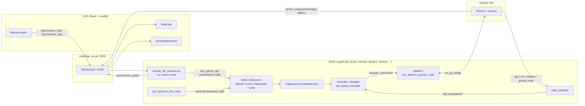

# NIDAR RescueSwarm — System Architecture

This documents the system as it actually runs today (verified live against the
simulation, not just read from source) — every topic, service, and action name below
was confirmed with `ros2 node list` / `ros2 topic list -t` / `ros2 service list -t` /
`ros2 action list -t` against a running 3-drone sim, not inferred from documentation.

To run everything described here: `./scripts/run_simulation.sh` (see
[Running it](#running-it) at the end).

## 1. High-level overview

Two independent paths can command a drone, and only one is normally active at a
time: **our `mission_file_executor.py`** (driven by the GCS, this is the path Phase
1 built and tests) and **the stock `as2_behavior_tree_node`** (driven by publishing
to a drone's `start` topic, used for the Phase 1 behavior-tree verification). Both
ultimately call the same behavior action servers underneath.

## 2. Per-drone node graph

Every drone gets its own fully independent copy of this stack, namespaced under
`/droneN`. Nothing below is shared between drones — there is no cross-drone
coordination yet (that's roadmap Phase 6).

| Node | Package | Responsibility |
|---|---|---|
| `platform` | `as2_platform_gazebo` | Owns the flight-state machine (`DISARMED → LANDED → TAKING_OFF → FLYING → LANDING`). Bridges `actuator_command/*` to Gazebo's `cmd_vel`/`arm` topics via `ros_gz_bridge`. Advertises which control modes it accepts (`HOVER`, `SPEED`, both `BODY_FLU`/`LOCAL_ENU` frames). |
| `state_estimator` | `as2_state_estimator` | Fuses GPS + IMU + Gazebo ground-truth into `self_localization/pose` and `self_localization/twist`, and publishes/maintains the TF tree (`earth → droneN/map → droneN/odom → droneN → droneN/base_link → ...`). Config here (`ground_truth` plugin, `use_gps: true`) is what makes `set_origin_on_start` establish the GPS origin used by every `go_to_gps_point` call. |
| `controller_manager` | `as2_motion_controller` (plugin: `pid_speed_controller`) | Negotiates a common control mode between whatever a behavior asks for (e.g. `POSITION YAW_ANGLE LOCAL_ENU_FRAME`) and what the platform accepts (`SPEED YAW_SPEED BODY_FLU_FRAME`), then runs the actual PID loop converting `motion_reference/*` into `actuator_command/*`. **This is the node whose config bug caused the Phase 0/1 takeoff-never-climbs incident** — see `Phase1_Test_Report.md` §1. |
| `TakeoffBehavior`, `GoToBehavior`, `FollowPathBehavior`, `LandBehavior` | `as2_behaviors_motion` | One ROS 2 action server each, implementing a single maneuver. These are what both `mission_file_executor.py` and the behavior tree actually call. |
| `TrajectoryGeneratorBehavior` | `as2_behaviors_trajectory_generation` (plugin: `dynamic_mav_trajectory_generator`) | Turns a behavior's goal into a smooth stream of position/velocity setpoints on `motion_reference/*`, rather than one static setpoint. |
| `bt_manager` / `as2_behavior_tree_node` | `as2_behavior_tree` | Runs a BehaviorTree.CPP tree (e.g. `trees/square.xml`) that calls the same action servers above in sequence. Gated by a `WaitForEvent` node subscribed to the drone's `start` topic. |
| `gps_bridge`, `ground_truth_bridge`, `gimbal_bridge`, `ros_gz_bridge` | `as2_gazebo_assets` | Translate Gazebo Transport messages into ROS 2 topics (and vice versa for `cmd_vel`/`arm`). Sim-only — a real Pixhawk deployment replaces these with `as2_platform_pixhawk`/mavlink, per the project roadmap's Phase 2. |
| `alphanumeric_viewer` | `as2_alphanumeric_viewer` | Text-dashboard dev tool (battery/IMU/platform status in a terminal UI) — not part of the mission-control data path. |
| `mission_executor` (CLI) | `as2_python_api` | An interactive REPL launched by the stock tmuxinator config for manual ad-hoc testing. Not used by our GCS or `mission_file_executor.py` — safe to ignore, harmless if left running. |

## 3. Topics (per drone, `/droneN/...`)

| Topic | Type | Published by | Consumed by |
|---|---|---|---|
| `sensor_measurements/gps` | `sensor_msgs/msg/NavSatFix` | `gps_bridge` | `state_estimator`, `GpsModule` (as2_python_api), **GCS** |
| `sensor_measurements/battery` | `sensor_msgs/msg/BatteryState` | Gazebo battery plugin via bridge | **GCS** |
| `sensor_measurements/imu` | `sensor_msgs/msg/Imu` | Gazebo IMU sensor via bridge | `state_estimator` |
| `self_localization/pose` | `geometry_msgs/msg/PoseStamped` | `state_estimator` | `controller_manager`, behaviors |
| `self_localization/twist` | `geometry_msgs/msg/TwistStamped` | `state_estimator` | `controller_manager` |
| `ground_truth/pose`, `ground_truth/twist` | `geometry_msgs/msg/PoseStamped` / `TwistStamped` | `ground_truth_bridge` | debugging only (bypasses the estimator) |
| `motion_reference/pose` | `geometry_msgs/msg/PoseStamped` | Active behavior (via `TrajectoryGeneratorBehavior`) | `controller_manager` |
| `motion_reference/twist` | `geometry_msgs/msg/TwistStamped` | Active behavior | `controller_manager` |
| `motion_reference/trajectory` | `as2_msgs/msg/TrajectorySetpoints` | `TrajectoryGeneratorBehavior` | `controller_manager` |
| `actuator_command/pose`, `/twist`, `/thrust`, `/trajectory` | `geometry_msgs`/`as2_msgs` | `controller_manager` (its PID output) | `platform` |
| `platform/info` | `as2_msgs/msg/PlatformInfo` | `platform` | Anything watching `armed`/`offboard`/state (e.g. diagnostics) |
| `controller/info` | `as2_msgs/msg/ControllerInfo` | `controller_manager` | Diagnostics |
| `mission_status` | `std_msgs/msg/String` | `as2_python_api`'s mission-interpreter adapter (used by `mission_interpreter.py` and the `mission_executor` CLI, §2) — no publisher exists unless one of those is actually running | Diagnostics (**not** the same as our custom `/gcs/mission_status` below) |
| `start` | `std_msgs/msg/String` | Whoever triggers a mission (we publish here manually or the GCS could) | `bt_manager`'s `WaitForEvent` node |
| `alert_event` | `as2_msgs/msg/AlertEvent` | `platform`/behaviors | Failsafe monitoring (used in roadmap Phase 3's failsafe testing) |
| `debug/*` (`ref_traj_point`, `traj_generated`, `waypoints`, ...) | `visualization_msgs`/`nav_msgs` | `TrajectoryGeneratorBehavior` | RViz visualization only |

Global (not namespaced): `/clock` (`rosgraph_msgs/msg/Clock`, sim time), `/tf`,
`/tf_static`, `/parameter_events`, `/rosout`.

### Our custom, non-namespaced topics (GCS ↔ `mission_file_executor.py`)

| Topic | Type | Direction |
|---|---|---|
| `/gcs/mission_load` | `std_msgs/msg/String` (JSON-encoded `MissionFile`) | GCS → executor |
| `/gcs/mission_start` | `std_msgs/msg/String` (payload ignored, any message triggers it) | GCS → executor |
| `/gcs/mission_status` | `std_msgs/msg/String` (JSON: `{state, detail, drones?, waypoint_index?}`) | executor → GCS |

## 4. Services (per drone)

| Service | Type | Purpose |
|---|---|---|
| `set_arming_state` | `std_srvs/srv/SetBool` | Arm (`true`) / disarm (`false`). Fails if already in the requested state — this is why "double-arm" attempts show up as `UAV is already armed` warnings, not crashes. |
| `set_offboard_mode` | `std_srvs/srv/SetBool` | Enter/exit offboard control. |
| `set_platform_control_mode` | `as2_msgs/srv/SetControlMode` | Negotiate the control mode between a behavior/controller and the platform. |
| `platform/list_control_modes` | `as2_msgs/srv/ListControlModes` | Query what modes the platform currently accepts (what we read to confirm `HOVER`/`SPEED` support). |
| `platform/state_machine_event` | `as2_msgs/srv/SetPlatformStateMachineEvent` | Low-level manual state-machine transition trigger. |
| `platform_takeoff`, `platform_land` | `std_srvs/srv/SetBool` | Direct platform-level takeoff/land, bypassing the `TakeoffBehavior`/`LandBehavior` action servers (those are the ones we actually use — this pair exists for lower-level tooling). |
| `set_origin` / `get_origin` | `as2_msgs/srv/SetOrigin` / `GetOrigin` | Set/read the GPS origin (lat/lon/alt) the `state_estimator` uses to convert between GPS and the local ENU frame. This is what `world.yaml`/`world_swarm.yaml`'s `origin:` field ultimately configures — see §7. |
| `controller/set_control_mode` | `as2_msgs/srv/SetControlMode` | Same negotiation, invoked from the controller side. |

(Every node also exposes the standard rclpy parameter services —
`get_parameters`, `set_parameters`, `list_parameters`, etc. — omitted above since
they're generic to every ROS 2 node, not architecture-specific.)

## 5. Action servers (per drone)

| Action | Type | Called by |
|---|---|---|
| `TakeoffBehavior` | `as2_msgs/action/Takeoff` | `mission_file_executor.py` (`DroneInterfaceGPS.takeoff()`), behavior tree's `TakeOff` node |
| `GoToBehavior` | `as2_msgs/action/GoToWaypoint` | `mission_file_executor.py` (`.go_to.go_to_gps_point()`), behavior tree's `GoTo` node |
| `FollowPathBehavior` | `as2_msgs/action/FollowPath` | Not currently used by our code — available for a multi-waypoint single-goal path instead of sequential `GoTo` calls |
| `LandBehavior` | `as2_msgs/action/Land` | `mission_file_executor.py` (`.land()`), behavior tree's `Land` node |
| `TrajectoryGeneratorBehavior` | `as2_msgs/action/GeneratePolynomialTrajectory` | Called internally by the motion behaviors above, not called directly by our code |

Other `as2_msgs` actions exist in the framework (`SetArmingState`, `SetOffboardMode`,
`NavigateToPoint`, `FollowReference`, `PointGimbal`, `DetectArucoMarkers`,
`SwarmFlocking`) but aren't instantiated by our current config — they belong to
packages (`as2_behaviors_perception`, `as2_behaviors_swarm_flocking`) we haven't
wired into `tmuxinator/aerostack2.yaml` yet.

## 6. GCS architecture (`/home/ayush/NIDAR/gcs`)

React + Vite + TypeScript, talking to the ROS graph over `rosbridge_suite`'s
WebSocket bridge via `roslib`.

| File | Responsibility |
|---|---|
| `src/ros/RosConnection.ts` | Single shared `roslib.Ros` WebSocket connection (`ws://localhost:9090` by default) — one connection for the whole app, matching the mission brief's "single operator interface" requirement. |
| `src/ros/useDroneTelemetry.ts` | Per-drone hook subscribing to `sensor_measurements/{gps,battery}`. Marks a drone disconnected if telemetry goes stale for 5s, independent of the rosbridge connection itself. |
| `src/ros/useMissionControl.ts` | Publishes `/gcs/mission_load` and `/gcs/mission_start`; subscribes `/gcs/mission_status`. |
| `src/mission/parseMissionFile.ts` | Dispatches by file extension: `.kml` → `parseKml.ts` (arena boundary only), `.json` → our own placeholder schema (fully self-contained: altitude, speed, per-drone waypoints). Both converge on the same `MissionFile` shape. |
| `src/mission/parseKml.ts` | Parses the organisers' arena-boundary KML (`@tmcw/togeojson`), swaps KML's `[lon,lat]` to our `[lat,lon]` convention, derives a centroid as a placeholder home point. No waypoints — those come from a coverage/mapping algorithm not yet integrated. |
| `src/components/MapView.tsx` | Leaflet map: live drone markers (connected/disconnected styling), mission boundary polygon, home marker, planned per-drone paths (dashed). Auto-fits to live drone positions on first GPS fix, and to a mission's boundary whenever one loads. |
| `src/components/MissionLoader.tsx` | File picker, mission summary, Start Mission button (disabled until a mission has actual per-drone waypoints — a boundary-only KML load can't start), live mission-status readout. |
| `src/components/DroneStatusPanel.tsx` | Per-drone GPS/altitude/battery cards + rosbridge connection-state banner. |

## 7. Custom node: `mission_file_executor.py`

The one piece of this system that isn't stock Aerostack2 — lives in
`project_gazebo/mission_file_executor.py`. Generic across any drone count/waypoint
list (unlike the stock `mission.py`/`mission_swarm.py` examples, which hardcode
their flight paths in Python).

Flow: subscribes `/gcs/mission_load` (stores the mission), waits for
`/gcs/mission_start` (the mission brief's one permitted manual trigger), then for
each drone in the mission: `arm() → offboard() → takeoff() → go_to_gps_point()` per
waypoint `→ land()`, publishing progress to `/gcs/mission_status` throughout. Uses
`as2_python_api`'s `DroneInterfaceGPS`, so waypoints are real GPS coordinates —
which is why the `state_estimator`'s configured origin (§2, `set_origin`/`get_origin`
in §4) has to actually match where the mission file's coordinates are, or a
`go_to_gps_point` call will try to fly to wherever's on the other side of that
mismatch (this exact failure mode showed up twice this project: once with the stock
`mission_gps.py` example against `world_swarm.yaml`, once transiently while testing
against a real-world location before `world_swarm.yaml`'s origin was updated to
match).

## Running it

`./scripts/run_simulation.sh` brings up everything described above in one command:
Gazebo + AS2 for every drone in `project_gazebo/config/world_swarm.yaml`,
`rosbridge_server`, `mission_file_executor.py`, and the GCS dev server. Ctrl+C (or
`./scripts/run_simulation.sh stop`) tears it all back down. Pass a comma-separated
drone list as an argument to override the default (every drone in
`world_swarm.yaml`); set `GCS_PORT` to change the GCS's port.
