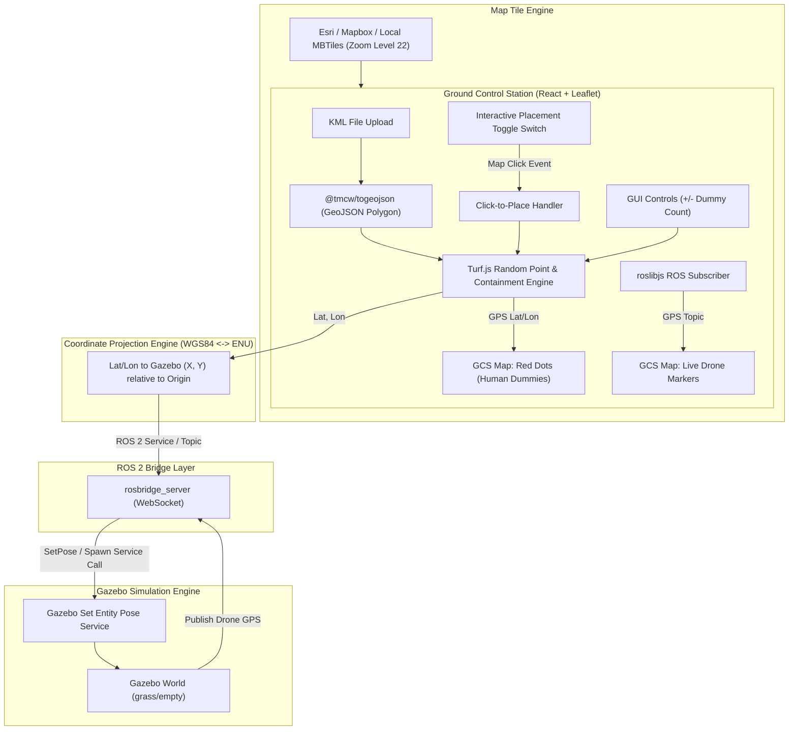
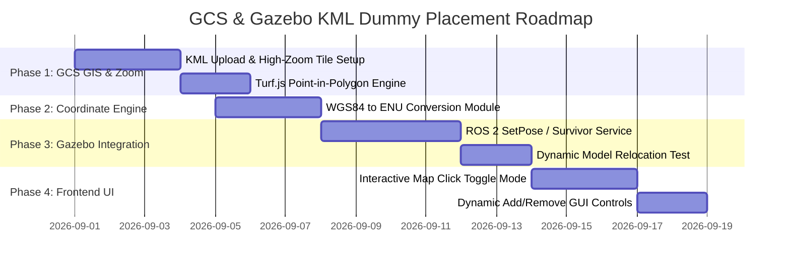

# Architecture & Technical Design: GCS Live Drone Visualization & KML-Constrained Dummy Placement in Gazebo

## 1. Executive Summary & Objective

This document outlines the technical design for expanding the **NIDAR RescueSwarm Ground Control Station (GCS)** and **Gazebo Simulation Engine** to support:
1. **Live Drone Trajectory & High-Zoom Map Visualization:** Real-time visual tracking of drone flight paths on an interactive GCS map with support for high-resolution imagery and deep zoom levels (up to zoom level 22+).
2. **KML Search Area Upload & Parsing:** Support for operators uploading `.kml` polygon files defining mission boundaries.
3. **Constrained Random Dummy Placement:** Automatically and randomly placing human victim/survivor dummy models inside the KML-bounded area, ensuring 100% of targets lie strictly within the operational search zone.
4. **Interactive Map Placement & Dynamic Dummy Controls:** A UI toggle switch for point-and-click dummy placement on the map, dynamic controls to add/remove dummy counts from the GUI, and bi-directional Gazebo synchronization.

---

## 2. Tech Stack Requirements

To implement this workflow without breaking existing ROS 2 / Aerostack2 components, the following tech stack and libraries are required:

| Layer | Component | Recommended Technology / Library | Purpose |
| :--- | :--- | :--- | :--- |
| **GCS Frontend** | UI Framework | React 18, TypeScript, Vite | Core GCS web application |
| **GCS Mapping** | Map Engine | `react-leaflet`, `leaflet` | Rendering map tiles, polygons, drone markers, red dummy dots |
| **High-Zoom Imagery** | Tile Sources | Esri Satellite, Mapbox, Local MBTiles | Providing high-resolution satellite imagery down to sub-meter zoom levels |
| **GIS & Geofencing** | KML Parser | `@tmcw/togeojson`, `DOMParser` | Parsing uploaded `.kml` XML files into standard GeoJSON Polygons |
| **GIS & Geofencing** | Spatial Math | `@turf/turf` (`@turf/booleanPointInPolygon`, `@turf/bbox`) | Checking point-in-polygon containment, bounding box generation, and random coordinate sampling |
| **Bridge Layer** | Web-to-ROS | `roslibjs`, `rosbridge_server` | WebSockets connection between React GCS and ROS 2 network |
| **Coordinate Engine** | Geo-Projection | `GeographicLib` / `pyproj` / custom WGS84 $\leftrightarrow$ ENU math | Translating global GPS (Latitude, Longitude) to Gazebo local Cartesian coordinates $(X, Y)$ |
| **Gazebo Simulator** | Model Relocation | Gazebo Sim (`gz sim`), `ros_gz_bridge`, `/world/<world>/set_pose` service | Spawning and dynamically moving human dummy models (`survivor_actor`) inside Gazebo |

---

## 3. High-Level System Architecture



---

## 4. Feature Implementation Breakdown

### 4.1. Live Drone Movement & High-Zoom Map Data

#### A. Telemetry & Trajectory Flow
1. `rosbridge_websocket` subscribes to sensor topics across all active drone namespaces (`drone0`, `drone1`, `drone2`, `drone3`).
2. `roslibjs` receives telemetry messages in React `MapView.tsx`.
3. `react-leaflet` dynamically updates `Marker` positions and appends points to a polyline trajectory history for visual path tracking.

#### B. Obtaining Deep / High-Resolution Zoom Data
Standard map tiles (like default OpenStreetMap) cap out at **Zoom Level 19** ($\sim 0.3\text{m / pixel}$), which can become blurry when zoomed in to inspect individual drones or dummy models. To get **more detailed zoom data**:

1. **High-Resolution Tile Providers:**
   * **Esri World Imagery (Satellite):** Native zoom up to level 19–20.
   * **Mapbox Satellite & Custom Vector Tiles:** High-definition satellite imagery supporting zoom levels up to **22+** ($\sim 0.04\text{m / pixel}$).
2. **Local / Offline Orthomosaic Tile Server (MBTiles / GeoTIFF):**
   * For specific search & rescue fields, high-resolution aerial photos captured by drones can be converted into tile pyramids (`MBTiles`) using `gdal2tiles` or `TileServer-GL` running locally on `http://localhost:8080/{z}/{x}/{y}.png`.
3. **Leaflet Upscaling Configuration (`maxNativeZoom` vs `maxZoom`):**
   * Configure `TileLayer` with `maxNativeZoom: 19` and `maxZoom: 23`. Leaflet will fetch max resolution tiles at level 19 and cleanly oversample/interpolate image pixels when zooming deeper, preventing gray/missing tile errors.

```tsx
<TileLayer
  attribution="&copy; Esri World Imagery"
  url="https://server.arcgisonline.com/ArcGIS/rest/services/World_Imagery/MapServer/tile/{z}/{y}/{x}"
  maxNativeZoom={19}
  maxZoom={22}
/>
```

---

### 4.2. KML Upload & Polygon Geofencing
- **KML Parsing:**
  - Operator uploads a `.kml` file via GCS `MissionLoader.tsx`.
  - DOMParser converts KML string into XML.
  - `@tmcw/togeojson` transforms KML XML into a standard `GeoJSON Feature<Polygon>`.
- **World Origin Alignment:**
  - Read Gazebo world origin spherical coordinates (defined in `config/world_swarm.yaml` or `grass.sdf.jinja`, e.g., $\text{Lat} = 28.682412, \text{Lon} = 77.499734, \text{Alt} = 100.0$).

---

### 4.3. Constrained Random Human Dummy Placement Algorithm

To guarantee all human dummies lie **strictly inside the KML-bounded arena**:

```typescript
import * as turf from '@turf/turf';

export function generateDummiesInKML(
  kmlPolygon: turf.Feature<turf.Polygon>,
  count: number
): Array<{ id: string; lat: number; lon: number }> {
  const bbox = turf.bbox(kmlPolygon); // [minX, minY, maxX, maxY]
  const dummies = [];

  let attempts = 0;
  const maxAttempts = count * 500;

  while (dummies.length < count && attempts < maxAttempts) {
    attempts++;
    // 1. Generate random point within bounding box
    const randomPt = turf.randomPoint(1, { bbox }).features[0];
    
    // 2. Check if point lies strictly inside KML polygon boundary
    if (turf.booleanPointInPolygon(randomPt, kmlPolygon)) {
      const [lon, lat] = randomPt.geometry.coordinates;
      dummies.push({
        id: `survivor_${dummies.length}`,
        lat,
        lon
      });
    }
  }

  return dummies;
}
```

---

### 4.4. Coordinate Transformation: WGS84 GPS $\leftrightarrow$ Gazebo Local Cartesian (X, Y)

Gazebo operates in a local East-North-Up (ENU) Cartesian frame $(X, Y, Z)$ measured in meters from the world origin $(0, 0, 0)$.

$$\Delta X = (Lon - Lon_0) \times \frac{\pi}{180} \times R_{earth} \times \cos\left(Lat_0 \times \frac{\pi}{180}\right)$$

$$\Delta Y = (Lat - Lat_0) \times \frac{\pi}{180} \times R_{earth}$$

Where:
- $R_{earth} \approx 6,378,137\text{ m}$ (WGS84 Equatorial Radius)
- $(Lat_0, Lon_0)$ = Gazebo Spherical Coordinate Origin (e.g. $28.682412, 77.499734$)

---

### 4.5. Interactive Map Dummy Placement & GUI Quantity Controls

#### A. Interactive Toggle Switch ("Placement Mode: ON/OFF")
Add a dedicated toolbar switch in the GCS UI:
* **Toggle OFF (Navigation Mode):** Normal map panning and zooming.
* **Toggle ON (Dummy Placement Mode):** Clicking anywhere on the map triggers a `useMapEvents` listener in Leaflet:
  1. Captures clicked `(lat, lng)`.
  2. Verifies if clicked coordinate lies **inside** the loaded KML boundary via `@turf/booleanPointInPolygon`.
  3. If valid, adds a new dummy red dot at that exact location and sends a live pose update to Gazebo.

```tsx
function MapClickHandler({ isPlacementMode, kmlPolygon, onAddDummy }: MapClickProps) {
  useMapEvents({
    click(e) {
      if (!isPlacementMode || !kmlPolygon) return;
      const point = turf.point([e.latlng.lng, e.latlng.lat]);
      
      if (turf.booleanPointInPolygon(point, kmlPolygon)) {
        onAddDummy(e.latlng.lat, e.latlng.lng);
      } else {
        alert("Clicked position is outside the KML search boundary!");
      }
    },
  });
  return null;
}
```

#### B. Dynamic GUI Quantity Controls (Add / Remove Dummies)
Provide controls in `DroneControlPanel.tsx`:
* **`+ Add Dummy` Button:** Spawns an additional dummy inside the boundary.
* **`- Remove Dummy` Button:** Removes the last selected or specified dummy.
* **`Dummy Count` Input / Slider:** Allows operators to set target count (e.g., 5, 10, 20 dummies) and click **"Randomize Locations"** to instantly generate and spawn all of them across the KML zone.

---

### 4.6. Gazebo Model Synchronization & Red Dot Rendering

#### A. GCS Red Dot Rendering
- In `MapView.tsx`, render each dummy as a `CircleMarker` with bright red styling:
  ```tsx
  {dummies.map((dummy) => (
    <CircleMarker
      key={dummy.id}
      center={[dummy.lat, dummy.lon]}
      radius={7}
      pathOptions={{ color: '#ef4444', fillColor: '#f87171', fillOpacity: 0.9, weight: 2 }}
    >
      <Popup>Victim / Human Dummy: {dummy.id}</Popup>
    </CircleMarker>
  ))}
  ```

#### B. Dynamic Gazebo Model Respawn / Pose Update (No Sim Restart)
- **Method A (Runtime ROS 2 Service Call):**
  Call Gazebo Transport / ROS 2 service `/world/<world_name>/set_pose` via `rosbridge_server`:
  ```json
  {
    "name": "survivor_0",
    "position": { "x": 8.0, "y": 10.0, "z": 0.0 },
    "orientation": { "x": 0, "y": 0, "z": 0, "w": 1 }
  }
  ```
- **Method B (File-Sync & Hot Reload):**
  GCS sends updated coordinates to backend helper script, updating `project_gazebo/config/survivors.yaml` and triggering `sync_survivors.py`.

---

## 5. Detailed Development Roadmap & Tasks



### Key Milestones:
1. **Phase 1 (GCS GIS & High Zoom Tiles):**
   - Install `@tmcw/togeojson` and `@turf/turf` in `gcs/package.json`.
   - Add `.kml` file picker and configure Esri/Mapbox Satellite tiles up to zoom level 22 in `MapView.tsx`.

2. **Phase 2 (Coordinate Conversion Engine):**
   - Create a shared TypeScript/Python module `geo_transform.ts` for Lat/Lon $\leftrightarrow$ Gazebo X/Y.
   - Use `world_swarm.yaml` spherical origin as reference.

3. **Phase 3 (Gazebo Service Integration):**
   - Expose Gazebo set_pose service through `rosbridge`.
   - Test repositioning `survivor_actor` models live in Gazebo without closing simulation.

4. **Phase 4 (GCS Controls & Interactive Placement):**
   - Add **Placement Mode Toggle Switch** to enable map click-to-place functionality.
   - Add **+ Add Dummy / - Remove Dummy** buttons and target count input to GCS toolbar.

---

## 6. Verification & Test Plan

1. **High Zoom Level Verification:**
   - Zoom in to level 21-22 in GCS; verify map tiles render cleanly without gray tiles or pixel tearing.
2. **Interactive Map Click Test:**
   - Enable Placement Mode toggle switch.
   - Click inside the KML boundary; verify red dot appears immediately and human dummy spawns in Gazebo at exact coordinates.
   - Click outside the KML boundary; verify warning prompt prevents placement outside search area.
3. **Dynamic Dummy Count Test:**
   - Use GUI buttons to add 5 dummies, then reduce to 2; verify Gazebo entity state updates cleanly in real time.
