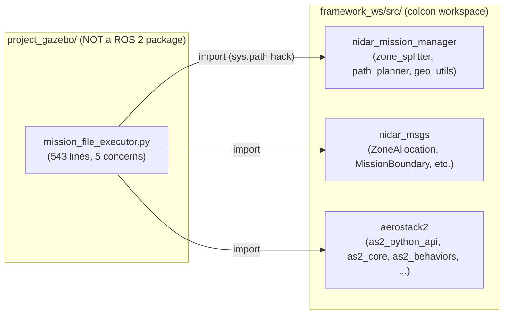
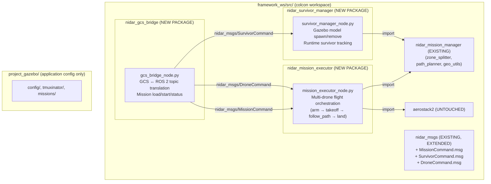

# Implementation Plan: Refactor `mission_file_executor.py` into Proper ROS 2 Packages

## Problem Statement

All NIDAR-specific mission orchestration logic is currently concentrated in a single 543-line Python script:
[project_gazebo/mission_file_executor.py](file:///home/ayush/NIDAR/project_gazebo/mission_file_executor.py)

This script simultaneously handles **five unrelated concerns**:
1. GCS mission loading & status publishing (topics: `/gcs/mission_load`, `/gcs/mission_start`, `/gcs/mission_status`)
2. Boundary-to-coverage zone splitting & lawnmower path generation
3. Multi-drone flight execution (arm → takeoff → follow_path → land)
4. Manual drone control commands (`/gcs/drone_control/command`)
5. Runtime Gazebo survivor model spawning & removal (`/gcs/survivor_control/command`)

It also lives **outside** the `framework_ws/src/` colcon workspace — in `project_gazebo/`, a project-application directory. It is launched as a bare `python3 -u mission_file_executor.py` process from the run script, not via `ros2 run` or `ros2 launch`. It imports `nidar_mission_manager` as a library but has no `package.xml`, no `setup.py`, and no ROS 2 package identity of its own.

---

## Current Architecture (As-Is)



**Problems with current structure:**
- **Not discoverable by `ros2 run` / `ros2 launch`** — can't be started the standard ROS 2 way.
- **Not testable in isolation** — no pytest structure, no `colcon test` integration.
- **Violates single responsibility** — changing survivor spawning logic risks breaking flight execution.
- **Won't scale to real hardware** — switching from Gazebo to PX4 requires editing the same monolith.
- **`sys.path` hack** — `utils/get_drones.py` is imported via filesystem path, not as a proper Python package.

---

## Aerostack2 Reference Patterns Observed

After walking the codebase, these are the ROS 2 conventions Aerostack2 follows:

### Package Layout (Python / `ament_python`)
Every Python ROS 2 package under `framework_ws/src/` follows this identical structure:
```
package_name/
├── package.xml              # ROS 2 manifest: name, deps, build_type
├── setup.py                 # setuptools with entry_points for ros2 run
├── setup.cfg                # [develop] script_dir, [install] install_scripts
├── resource/package_name    # empty marker file for ament index
├── package_name/            # Python module (same name as package)
│   ├── __init__.py
│   ├── node_a.py            # One ROS 2 node per file
│   └── helpers.py           # Pure library functions (no Node)
└── tests/
```

Examples: [nidar_mission_manager](file:///home/ayush/NIDAR/framework_ws/src/nidar_mission_manager), [as2_python_api](file:///home/ayush/NIDAR/framework_ws/src/aerostack2/as2_python_api)

### Key Conventions
| Convention | How Aerostack2 Does It | Where We See It |
|---|---|---|
| **One node = one concern** | `as2_state_estimator`, `as2_motion_controller`, `as2_platform_gazebo` are all separate packages, each with one primary node | [tmuxinator/aerostack2.yaml](file:///home/ayush/NIDAR/project_gazebo/tmuxinator/aerostack2.yaml) launches them separately per drone |
| **Messages in dedicated `_msgs` package** | `as2_msgs/` holds all `.msg`/`.srv`/`.action` definitions; NIDAR already has `nidar_msgs/` | [nidar_msgs/](file:///home/ayush/NIDAR/framework_ws/src/nidar_msgs) |
| **Pure algorithm libraries** | `nidar_mission_manager` contains `zone_splitter.py`, `path_planner.py`, `geo_utils.py` — zero ROS dependencies, imported by nodes | [nidar_mission_manager/](file:///home/ayush/NIDAR/framework_ws/src/nidar_mission_manager/nidar_mission_manager) |
| **Nodes registered as console_scripts** | `setup.py` `entry_points` → `ros2 run package_name node_name` | [as2_python_api/setup.py L22-24](file:///home/ayush/NIDAR/framework_ws/src/aerostack2/as2_python_api/setup.py#L22-L24) |
| **Launch files compose nodes** | A launch file or tmuxinator session wires nodes together per-drone | [tmuxinator/aerostack2.yaml](file:///home/ayush/NIDAR/project_gazebo/tmuxinator/aerostack2.yaml) |
| **Config via YAML params** | Platform config, controller gains, etc. loaded from `config/*.yaml` | [project_gazebo/config/](file:///home/ayush/NIDAR/project_gazebo/config) |

---

## Proposed Architecture (To-Be)

Split `mission_file_executor.py` into **3 new ROS 2 packages** under `framework_ws/src/`, each with a single well-scoped node:



---

## Proposed Changes

### Component 1: Message Definitions

#### [MODIFY] [nidar_msgs](file:///home/ayush/NIDAR/framework_ws/src/nidar_msgs)

Add typed ROS 2 messages to replace the current `std_msgs/String` JSON blobs flowing between the GCS bridge and executor nodes. This is how Aerostack2 does it — see [as2_msgs/msg/MissionUpdate.msg](file:///home/ayush/NIDAR/framework_ws/src/aerostack2/as2_msgs/msg/MissionUpdate.msg) which uses typed fields + a `string mission` JSON payload for the flexible part.

#### [NEW] `nidar_msgs/msg/MissionCommand.msg`
```
# Mission load/start/abort commands from GCS
uint8 LOAD=0
uint8 START=1
uint8 ABORT=2

uint8 action
string mission_json   # Full mission JSON (only for LOAD)
```

#### [NEW] `nidar_msgs/msg/DroneCommand.msg`
```
# Manual drone control command
string drone_id       # "drone0" or "all"
string action         # "arm", "disarm", "takeoff"
float32 altitude_m    # For takeoff
```

#### [NEW] `nidar_msgs/msg/SurvivorCommand.msg`
```
# Runtime survivor spawn/remove
string action         # "add", "remove", "clear"
string survivor_id    # For remove
float64 latitude      # For add
float64 longitude     # For add
```

#### [MODIFY] `nidar_msgs/CMakeLists.txt`
Register the 3 new `.msg` files in `rosidl_generate_interfaces()`.

---

### Component 2: GCS Bridge Node

#### [NEW] Package `nidar_gcs_bridge` under `framework_ws/src/`

```
framework_ws/src/nidar_gcs_bridge/
├── package.xml
├── setup.py
├── setup.cfg
├── resource/nidar_gcs_bridge
├── nidar_gcs_bridge/
│   ├── __init__.py
│   └── gcs_bridge_node.py
└── tests/
```

**Responsibility:** Translates between the GCS WebSocket world (`std_msgs/String` JSON on `/gcs/*` topics via rosbridge) and the typed NIDAR ROS 2 message interfaces. This is the **only** node that knows about the GCS's JSON wire format.

**Subscribes to (from GCS via rosbridge):**
- `/gcs/mission_load` (`std_msgs/String`) → parses JSON → publishes `nidar_msgs/MissionCommand` (action=LOAD)
- `/gcs/mission_start` (`std_msgs/String`) → publishes `nidar_msgs/MissionCommand` (action=START)
- `/gcs/drone_control/command` (`std_msgs/String`) → parses JSON → publishes `nidar_msgs/DroneCommand`
- `/gcs/survivor_control/command` (`std_msgs/String`) → parses JSON → publishes `nidar_msgs/SurvivorCommand`

**Subscribes to (from other NIDAR nodes):**
- `/nidar/mission_status` (`nidar_msgs/MissionStatus`) → serializes → publishes `/gcs/mission_status` (`std_msgs/String`)
- `/nidar/zone_allocation` (`nidar_msgs/ZoneAllocation`) → forwards to `/gcs/mission/zone_allocation`

**Extracts from `mission_file_executor.py`:** Lines 156-161 (`_on_load`), 163-171 (`_on_start`), 384-389 (`_on_drone_command`), 445-451 (`_on_survivor_command`), and all `_publish_*` methods that serialize JSON for the GCS.

---

### Component 3: Mission Executor Node

#### [NEW] Package `nidar_mission_executor` under `framework_ws/src/`

```
framework_ws/src/nidar_mission_executor/
├── package.xml
├── setup.py
├── setup.cfg
├── resource/nidar_mission_executor
├── nidar_mission_executor/
│   ├── __init__.py
│   ├── mission_executor_node.py
│   └── flight_runner.py         # Pure-logic: arm/takeoff/follow_path/land sequences
├── config/
│   └── executor_params.yaml     # Timeouts, retry counts, default altitudes
└── tests/
```

**Responsibility:** Receives typed mission commands, runs zone splitting + path planning (via `nidar_mission_manager` library), and orchestrates multi-drone flight execution using `as2_python_api.DroneInterfaceGPS`.

**Subscribes to:**
- `/nidar/mission_command` (`nidar_msgs/MissionCommand`)
- `/nidar/drone_command` (`nidar_msgs/DroneCommand`)

**Publishes:**
- `/nidar/mission_status` (typed `nidar_msgs/MissionStatus` or `std_msgs/String` JSON for backward compat)
- `/nidar/zone_allocation` (`nidar_msgs/ZoneAllocation`)
- `/nidar/planned_paths` (`std_msgs/String`)

**Extracts from `mission_file_executor.py`:** Lines 184-378 (all `_run_mission`, `_run_json_waypoint_mission`, `_run_boundary_coverage_mission`, `_publish_zone_allocations`, `_publish_planned_paths`) and lines 392-439 (drone control execution + `_call_bounded`).

---

### Component 4: Survivor Manager Node

#### [NEW] Package `nidar_survivor_manager` under `framework_ws/src/`

```
framework_ws/src/nidar_survivor_manager/
├── package.xml
├── setup.py
├── setup.cfg
├── resource/nidar_survivor_manager
├── nidar_survivor_manager/
│   ├── __init__.py
│   └── survivor_manager_node.py
└── tests/
```

**Responsibility:** Manages runtime Gazebo model spawning/removal for survivor dummies. Completely independent of mission flight execution.

**Subscribes to:**
- `/nidar/survivor_command` (`nidar_msgs/SurvivorCommand`)

**Publishes:**
- `/nidar/survivors_list` (`std_msgs/String`) — current list of active survivors + GPS positions
- `/nidar/survivor_status` (`std_msgs/String`) — per-action result feedback

**Extracts from `mission_file_executor.py`:** Lines 445-531 (all `_on_survivor_command`, `_add_survivor`, `_remove_survivor`, `_publish_survivors_list`, `_publish_survivor_status`).

---

### Component 5: Launch & Wiring Updates

#### [MODIFY] [project_gazebo/tmuxinator/aerostack2.yaml](file:///home/ayush/NIDAR/project_gazebo/tmuxinator/aerostack2.yaml)
Currently does not launch `mission_file_executor.py` (it's started separately by `run_simulation.sh`). No change needed to this file.

#### [MODIFY] [scripts/run_simulation.sh](file:///home/ayush/NIDAR/scripts/run_simulation.sh)
Replace:
```bash
nohup python3 -u mission_file_executor.py > "$LOG_DIR/executor.log" 2>&1 &
```
With:
```bash
nohup ros2 run nidar_gcs_bridge gcs_bridge_node > "$LOG_DIR/gcs_bridge.log" 2>&1 &
nohup ros2 run nidar_mission_executor mission_executor_node > "$LOG_DIR/mission_executor.log" 2>&1 &
nohup ros2 run nidar_survivor_manager survivor_manager_node > "$LOG_DIR/survivor_manager.log" 2>&1 &
```

#### [DELETE] [project_gazebo/mission_file_executor.py](file:///home/ayush/NIDAR/project_gazebo/mission_file_executor.py)
Removed after all logic is extracted into the 3 new packages.

---

## Open Questions

> [!IMPORTANT]
> **Backward Compatibility with GCS:**
> The GCS frontend (`gcs/src/ros/useMissionControl.ts`, `useDroneControl.ts`, `useSurvivorControl.ts`) currently talks to the monolith via JSON over `std_msgs/String` topics. The `nidar_gcs_bridge` node preserves these exact topic names and JSON shapes, so **zero GCS frontend changes** are needed in Phase 1. Should we eventually migrate the GCS to use typed `nidar_msgs` directly via rosbridge (Phase 2), or keep the JSON bridge layer permanently?

---

## Verification Plan

### Build Verification
```bash
cd ~/NIDAR/framework_ws
colcon build --packages-select nidar_msgs nidar_gcs_bridge nidar_mission_executor nidar_survivor_manager
source install/setup.bash
```

### Node Discovery Test
```bash
ros2 run nidar_gcs_bridge gcs_bridge_node &
ros2 run nidar_mission_executor mission_executor_node &
ros2 run nidar_survivor_manager survivor_manager_node &
ros2 node list
# Expected: /gcs_bridge, /mission_executor, /survivor_manager
```

### Integration Test
```bash
# Full simulation with refactored nodes:
./scripts/run_simulation.sh
# In GCS browser: Load map.kml → Start Mission → verify drones fly
```

### Regression Test
- All existing GCS functionality (mission load, start, drone arm/takeoff, survivor add/remove) must work identically with the same GCS frontend code — no frontend changes.
